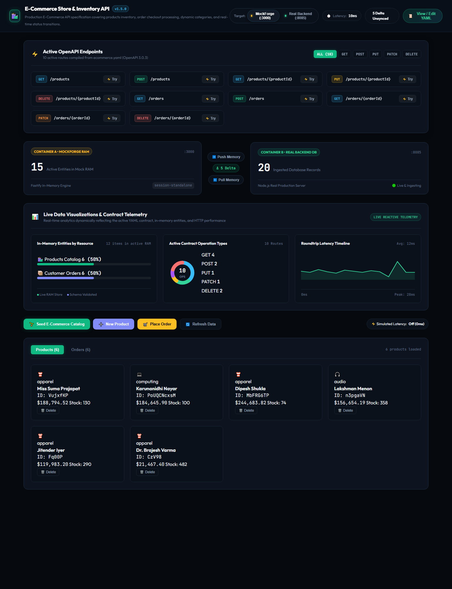
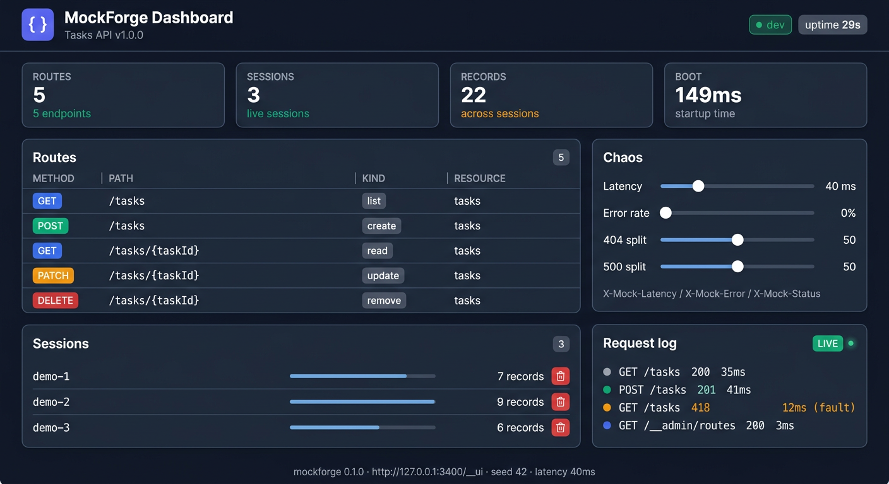
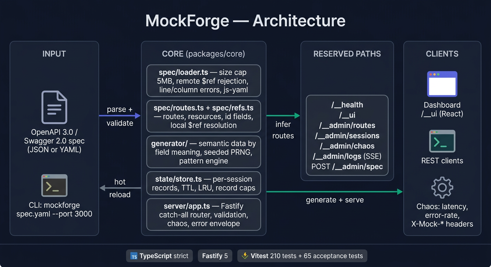
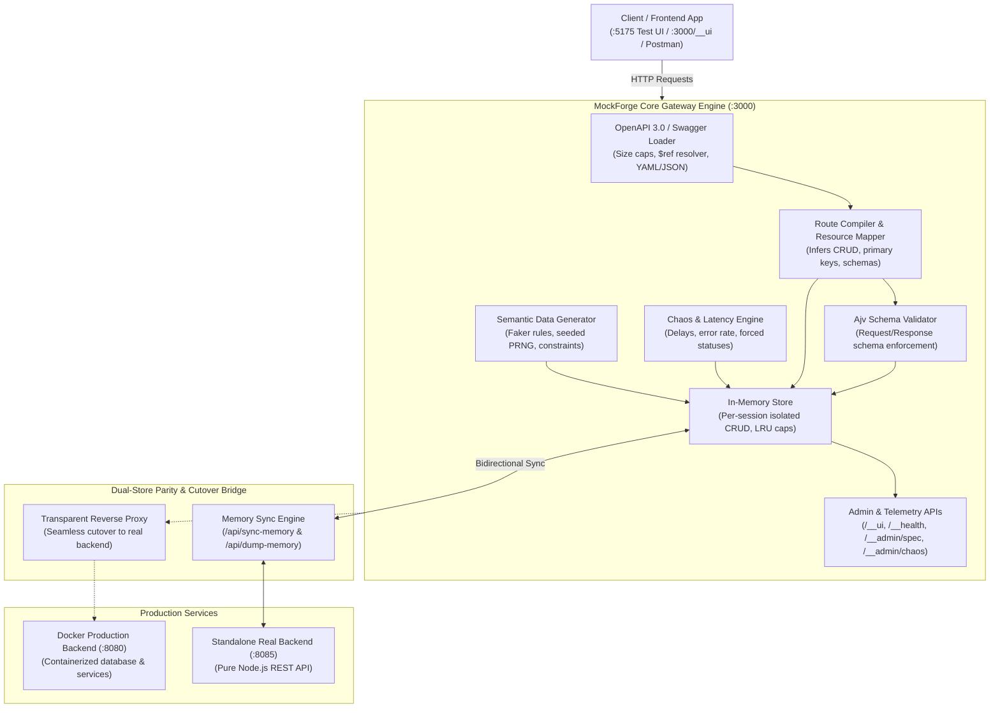

# MockForge

**A mock REST server generator.** Point it at an OpenAPI 3.0 or Swagger 2.0 spec and
it gives you a running HTTP backend — realistic data, real state, per-session
isolation, chaos controls and a live dashboard — in well under five seconds.

```bash
mockforge samples/tasks.yaml --port 3000
```

```
  MockForge v0.1.0
  Spec:       Tasks API v1.0.0
  Routes:     5  (1 resource)
  Boot:       156 ms
  Server:     http://127.0.0.1:3000
  Dashboard:  http://127.0.0.1:3000/__ui
```

No code to write, no fixtures to maintain, no YAML fixtures drifting out of date.
Your spec *is* the mock.



> **Quick Links:**
> - 🚀 **[Setup & Troubleshooting Manual](docs/SETUP_AND_TROUBLESHOOTING.md)** — Complete step-by-step setup, port allocation, and error resolution.
> - 🛍️ **[Standalone E-Commerce Test Suite](demos/standalone-test/)** — Dedicated client UI (`:5175`), real backend (`:8085`), and OpenAPI spec (`ecommerce.yaml`).
> - 📊 **Interactive Dashboard**: `http://127.0.0.1:3000/__ui` | **Test Client**: `http://127.0.0.1:5175`

---

## Contents

- [What it does](#what-it-does)
- [Quick start (5 seconds)](#quick-start-5-seconds)
- [Set it up on your PC](#set-it-up-on-your-pc)
- [The CLI](#the-cli)
- [What you get](#what-you-get)
- [Semantic data](#semantic-data)
- [Stateful CRUD](#stateful-crud)
- [Session isolation](#session-isolation)
- [Chaos engineering](#chaos-engineering)
- [The reserved API surface](#the-reserved-api-surface)
- [Uploading a spec](#uploading-a-spec)
- [The dashboard](#the-dashboard)
- [Error shape](#error-shape)
- [Security](#security)
- [Project structure](#project-structure)
- [Architecture](#architecture)
- [Samples and demos](#samples-and-demos)
- [Running the tests](#running-the-tests)
- [Troubleshooting](#troubleshooting)
- [Development](#development)

---

## What it does

| | |
|---|---|
| **Input** | An OpenAPI 3.x or Swagger 2.0 document, JSON or YAML, on disk or over HTTP |
| **Output** | A Fastify server that serves every path in the spec, with the right methods, status codes and shapes |
| **Data** | Values generated *by field meaning*: `email` is a real address, `phone` is an Indian mobile, `createdAt` is an ISO-8601 timestamp inside a two-year window, `price` has exactly two decimals |
| **State** | An in-memory store per session: create, read, update, delete, with the status codes a real backend would use |
| **Chaos** | Latency and error rates, globally or per request |
| **Isolation** | `X-Session-Id` gives every caller its own dataset |
| **Validation** | Request bodies that break the spec get a `400` naming the offending path |

Everything runs on your machine. Nothing is phoned home.

---

## Quick start (5 seconds)

With the repository cloned and built (see [Set it up on your PC](#set-it-up-on-your-pc)):

```bash
node packages/cli/dist/index.js ./your-spec.yaml --port 3000
```

Then:

```bash
curl http://127.0.0.1:3000/__health
curl http://127.0.0.1:3000/users?limit=3
open http://127.0.0.1:3000/__ui        # the dashboard
```

Or link the command once so it reads like a normal CLI:

```bash
npm link --workspace mockforge
mockforge ./your-spec.yaml --port 3000
```

---

## Set it up on your PC

### What you need

- **Node.js 20 or newer** — check with `node --version`
- **npm 9 or newer** (ships with Node)
- Nothing else. No database, no Docker, no build tools beyond what npm installs.

### 1. Get the code

```bash
git clone https://github.com/17krishna8/project.git
cd project/mockforge
```

### 2. Install and build, in one command

```bash
npm run setup
```

That runs `npm install` (an npm workspaces monorepo — `packages/core`,
`packages/cli`, `apps/dashboard`) followed by `npm run build`.

Two things get built:

- `packages/core` and `packages/cli` — TypeScript compiled to `dist/`
- `apps/dashboard` — the React dashboard, bundled by Vite into `apps/dashboard/dist`

> **Note.** The build order matters: the CLI imports `@mockforge/core`, so core is
> compiled first. `npm run build` handles that for you.

### 3. Run it

```bash
npm start
```

That boots `samples/tasks.yaml` on port 3000. Override the port with
`PORT=8080 npm start`, or run any spec directly:

```bash
node packages/cli/dist/index.js ./your-spec.yaml --port 3000
```

Or link the command once so it reads like a normal CLI:

```bash
npm link --workspace mockforge
mockforge ./your-spec.yaml --port 3000
```

### 4. Open the dashboard

Browse to <http://127.0.0.1:3000/__ui>.



> **The dashboard never needs a separate build step or dev server.** It is served
> by the mock itself on the same origin, and if the built bundle is ever missing
> the server falls back to a self-contained page with the same features.

### Verify the whole thing works

```bash
npm run lint          # eslint, 0 problems
npm run typecheck     # tsc --noEmit across every workspace
npm run test:coverage # 216 unit tests, coverage gates
npm run acceptance    # 65 acceptance tests, one suite per requirement group
npm run integrity     # checks the acceptance lock and the protected paths
```

> **If the server will not start** with `Cannot find module
> '.../packages/cli/dist/index.js'`, the build output is missing — run
> `npm run setup`. This is the most common stumble: `dist/` is a build artifact
> and is not committed, so a fresh clone always needs one build.

---

## The CLI

```
mockforge <specFile> [options]

  --port <n>            port to listen on (default 3000)
  --host <addr>         host to bind (default 127.0.0.1)
  --latency <ms>        base latency injected into every response (default 0)
  --error-rate <0..1>   probability of an injected fault (default 0)
  --error-split <a:b>   404:500 weights for injected faults (default 50:50)
  --seed <n>            deterministic generation seed
  --watch               reload the mock when the spec file changes
  --session-ttl-min <n> session time-to-live in minutes (default 60)
  --max-sessions <n>    maximum live sessions, LRU evicted (default 500)
  --max-records <n>     maximum records per session resource (default 10000)
  --mode <dev|prod>     dev validates every response against the spec (default dev)
  --dashboard <dir>     directory with the built dashboard
  -h, --help            show this help
  -v, --version         show version
```

A few worth knowing:

- `--seed 42` makes every generated value reproducible. Combine it with an
  explicit `X-Session-Id` and two runs produce byte-identical responses.
- `--watch` re-reads the spec when the file changes. Sessions survive.
- `--mode prod` turns off response validation (see [The dashboard](#the-dashboard)).

---

## What you get

### 1. Semantic data

Generated values are derived from what the field *means*, not just its type. See
[Semantic data](#semantic-data).

### 2. Stateful CRUD

`POST` creates and returns `201`, `GET` reads, `PUT`/`PATCH` update, `DELETE`
returns `204`, and an unknown id is a `404`. Lists carry `X-Total-Count` and
understand `limit`, `offset`, `page`, `sort`, `order` and arbitrary filters.

### 3. Chaos

Latency, error rates and a 404:500 split, set globally or per request.

### 4. Per-session isolation

Every caller gets its own dataset, keyed by `X-Session-Id`.

### 5. Strict schema adherence

Every request body is validated against the spec before it is stored, and in dev
mode every response is validated before it is sent.

### 6. Fast boot

A 200-route spec is serving requests in a fraction of the five-second budget.

---

## Semantic data

The generator looks at the property *name* first, then the schema, and only falls
back to structure when neither says anything meaningful.

| Field name looks like | You get |
|---|---|
| `email`, `assigneeEmail` | a valid address, often an Indian domain |
| `phone`, `mobile` | `^(\+91)?[6-9]\d{9}$` — a real Indian mobile shape |
| `postalCode`, `pincode`, `zip` | `^[1-9][0-9]{5}$` |
| `price`, `amount`, `total`, `balance`, `fee` | a positive number with exactly two decimals |
| `createdAt`, `updatedAt`, `placedAt` | ISO-8601, within the last two years |
| `dueDate`, `joinedAt` (date) | `YYYY-MM-DD` |
| `id`, `uuid` | a well-formed id / uuid v4 |
| `name`, `firstName`, `lastName` | an Indian name from `@faker-js/faker` (`en_IN`) |
| `url`, `website`, `avatar` | a plausible absolute URL |
| `ip`, `ipAddress` | a valid IPv4 address |

On top of that, the schema is always honoured: `enum` picks one of the values,
`required` fields are always present, `minimum`/`maximum` are respected,
`minLength`/`maxLength` are respected, `pattern` is matched character by
character, and a field is never `null` unless the spec says `nullable`.

Every semantic value is checked against the schema before it is used — if the
rule would break a constraint, it steps aside and structural generation (which
respects the constraints exactly) takes over.

---

## Stateful CRUD

```bash
# Seed data is there from the first request
curl 'http://127.0.0.1:3000/users?limit=3' -H 'x-session-id: demo'

# Create -> 201, with the generated fields filled in
curl -X POST http://127.0.0.1:3000/users \
  -H 'content-type: application/json' -H 'x-session-id: demo' \
  -d '{"name":"Asha Menon","email":"asha@example.in"}'

# Read, update, delete
curl http://127.0.0.1:3000/users/usr_9f2Kd1
curl -X PATCH http://127.0.0.1:3000/users/usr_9f2Kd1 \
  -H 'content-type: application/json' -H 'x-session-id: demo' -d '{"status":"blocked"}'
curl -X DELETE http://127.0.0.1:3000/users/usr_9f2Kd1 -H 'x-session-id: demo'   # 204

# Unknown id -> 404
curl http://127.0.0.1:3000/users/usr_nope -H 'x-session-id: demo'
```

Listing, paging, sorting and filtering:

```bash
curl 'http://127.0.0.1:3000/users?limit=10&page=2'                  # paging
curl 'http://127.0.0.1:3000/users?sort=balance&order=desc'          # sorting
curl 'http://127.0.0.1:3000/users?status=active'                    # filtering
```

`X-Total-Count` is the number of records matching the filters, before paging.

Sessions hold between 5 and 10 seeded records per resource, and are capped by
`--max-records` (default 10 000), `--max-sessions` (default 500) and
`--session-ttl-min` (default 60). Records are evicted least-recently-used, and a
background sweep removes expired sessions.

---

## Session isolation

Send `X-Session-Id` and that session owns its own copy of the data:

```bash
curl 'http://127.0.0.1:3000/users?limit=1' -H 'x-session-id: alice'
curl 'http://127.0.0.1:3000/users?limit=1' -H 'x-session-id: bob'    # different data
```

Resolution order:

1. the `X-Session-Id` header
2. the `mf_session` cookie
3. a fresh random id per request, so anonymous callers never share state by accident

Session ids are limited to 64 characters from `[A-Za-z0-9_-]`; anything else
falls back to a hashed id, so a hostile header cannot collide with another
caller's session.

---

## Chaos engineering

Globally, at boot:

```bash
mockforge spec.yaml --latency 250 --error-rate 0.1 --error-split 70:30
```

Per request, with headers:

| Header | Effect |
|---|---|
| `X-Mock-Latency: <ms>` | delay this response by up to 3000 ms |
| `X-Mock-Error: 1` | force a fault on this response — `404` or `500` per the split |
| `X-Mock-Error: 503` | force exactly that status (same as `X-Mock-Status`) |
| `X-Mock-Status: <100-599>` | force this status, code `MOCKFORGE_INJECTED_<status>` |

Live, without a restart:

```bash
curl -X PUT http://127.0.0.1:3000/__admin/chaos \
  -H 'content-type: application/json' \
  -d '{"latencyMs":100,"errorRate":0.25,"split404":60,"split500":40}'
```

Faults only ever fire on *matched* routes. `/__health`, `/__ui` and `/__admin/*`
are registered before the catch-all, so the control plane stays clean even at
100% error rate.

---

## The reserved API surface

| Endpoint | Purpose |
|---|---|
| `GET /__health` | `{status, routes, sessions, uptimeMs, bootMs, specLoaded}` |
| `GET /__ui` | the dashboard |
| `GET /__admin/routes` | every inferred route: method, path, kind, resource |
| `GET /__admin/sessions` | live sessions and their record counts |
| `GET /__admin/sessions/:id/data` | one session's records, keyed by resource |
| `DELETE /__admin/sessions/:id` | drop a session (`204`, or `404`) |
| `GET /__admin/chaos` · `PUT /__admin/chaos` | read / change the chaos settings |
| `GET /__admin/logs` | Server-Sent Events stream of every request |
| `POST /__admin/spec` | upload a spec, or reload the file on disk |

The log stream carries one JSON event per request:

```json
{"time":"2026-09-30T10:33:34.399Z","session":"demo","method":"GET","path":"/tasks",
 "status":200,"latencyMs":27,"fault":null,"validation":null}
```

---

## Uploading a spec

You do not have to put a file on disk. Start the mock with **no spec at all**
and it serves an upload view:

```bash
node packages/cli/dist/index.js --port 3000
```

```
  MockForge v0.1.0
  Spec:       No spec loaded v-
  Routes:     0  (0 resources)
  Dashboard:  http://127.0.0.1:3000/__ui
```

Browse to `/__ui` and you get the first of the two views: a drop zone for a
`.json`, `.yaml` or `.yml` file, plus a stage-by-stage view of what happens to
it - read, parse, validate, infer routes, serve. Nothing leaves your machine.

The moment a spec is accepted, the view switches to the operating dashboard
(routes, sessions, chaos, live log). **If the file is wrong, the dashboard never
appears** - you stay on the upload view with the parser's own error, including
the line and column:

```
That spec was rejected
Spec rejected: Spec is not valid JSON or YAML: unexpected end of the stream (4:1)
```

The same thing over HTTP, which is what the dashboard calls:

```bash
curl -X POST http://127.0.0.1:3000/__admin/spec \
  -H 'content-type: application/json' \
  -d '{"spec":"<the file contents>","filename":"my-api.yaml"}'
# -> {"title":"My API","version":"1.0.0","routes":8,"resources":2,
#     "reloaded":true,"source":"upload","filename":"my-api.yaml"}
```

`POST /__admin/spec` with **no body** still means "re-read the file on disk", so
the old hot-reload behaviour is unchanged. An upload replaces the previous spec
in place: sessions, chaos settings and the socket all survive, and the old paths
start answering `404`.

Two limits apply, and they are enforced in this order:

1. the **1 MB request-body limit** fires first, so an oversized upload is a
   `413 MOCKFORGE_BODY_TOO_LARGE` before the parser ever sees it;
2. the **5 MB spec limit** still guards specs read from disk.

## The dashboard

`http://127.0.0.1:3000/__ui` — same origin as the API, no proxy needed.

There are two views, and the server chooses between them. With no spec loaded
you get the **upload view** (drop a file, watch the pipeline run, see the error
if the spec is wrong). Once a spec is loaded you get the **operating view**
below. An invalid upload never reaches the operating view.

- **Try a route** — pick any endpoint, send it, see the real status, latency and body
- **Route table** — every path the spec produced, with its kind and resource
- **Sessions panel** — live sessions, record counts, per-session data, delete
- **Chaos panel** — sliders for latency, error rate and the 404:500 split
- **Log stream** — the SSE feed, live, with status and latency per request
- **Health badge** — routes, sessions, uptime

The React app in `apps/dashboard` is the full experience. If its build output is
missing, the server serves a self-contained fallback page with the same features,
so `/__ui` is never a dead end.

`--mode prod` disables response validation, which is what you want once the mock
is feeding a real test suite.

---

## Error shape

Every error is the same envelope:

```json
{
  "error": {
    "code": "MOCKFORGE_VALIDATION_ERROR",
    "message": "Request body does not match the schema for POST /users",
    "details": [{ "path": "/balance", "reason": "must be >= 0" }]
  }
}
```

| Code | Status | When |
|---|---|---|
| `MOCKFORGE_VALIDATION_ERROR` | 400 | the request body breaks the spec |
| `MOCKFORGE_NOT_FOUND` | 404 | no route, or an unknown record id |
| `MOCKFORGE_INJECTED_404` / `MOCKFORGE_INJECTED_500` | 404 / 500 | injected by the error rate |
| `MOCKFORGE_INJECTED_<status>` | that status | forced by `X-Mock-Status` |
| `MOCKFORGE_SCHEMA_MISMATCH` | 500 | dev mode: the mock's own response broke the spec |
| `MOCKFORGE_SPEC_INVALID` | 400 | `POST /__admin/spec` was handed a bad document |
| `MOCKFORGE_SESSION_NOT_FOUND` | 404 | `DELETE /__admin/sessions/:id` missed |
| `MOCKFORGE_INVALID_JSON_BODY` | 400 | the body is not valid JSON, or carries `__proto__`/`constructor`/`prototype` |
| `MOCKFORGE_METHOD_NOT_ALLOWED` | 405 | the path exists but not for that method |
| `MOCKFORGE_BODY_TOO_LARGE` | 413 | a request body over 1 MB, or a spec over 5 MB |
| `MOCKFORGE_UNSUPPORTED_MEDIA_TYPE` | 415 | a non-JSON body |

---

## Security

The spec is untrusted input, so:

- **Local `$ref`s only.** A remote reference (`http://…`, `//host/…`) is rejected
  and named, so a spec cannot make the mock fetch arbitrary URLs.
- **Size caps.** Specs over 5 MB and request bodies over 1 MB are refused.
- **`$ref` depth and step limits.** Circular references are resolved to a bounded
  depth instead of hanging the process.
- **Regex timeouts.** Pattern matching runs under a step budget, so a hostile
  pattern cannot cause catastrophic backtracking.
- **No prototype pollution.** `__proto__`, `constructor` and `prototype` keys in
  a body are rejected rather than merged.
- **Bounded session ids.** 64 characters, `[A-Za-z0-9_-]`, so a hostile header
  cannot forge or collide with another caller's session.

---

## Project structure

```
mockforge/
├── packages/
│   ├── core/                  the engine — no HTTP server of its own
│   │   └── src/
│   │       ├── spec/          loader, route inference, $ref resolution
│   │       ├── generator/     semantic rules, seeded PRNG, pattern engine
│   │       ├── state/         the per-session store (TTL, LRU, caps)
│   │       ├── server/        Fastify app, sessions, validation, dashboard
│   │       └── __tests__/     216 unit tests
│   └── cli/                   the `mockforge` command
├── apps/
│   └── dashboard/             React + Vite + Tailwind, served at /__ui
├── acceptance/                the acceptance suite (read-only contract)
├── samples/                   ready-to-run example specs
├── demos/                     scripted, transcript-producing demos
├── docs/                      architecture diagram, contract, presentation facts
└── scripts/                   acceptance runner and integrity checks
```

---

## Architecture & System Design





### How the Project Works (Workflow)

1. **Spec Ingestion**: Point MockForge at an OpenAPI 3.0 or Swagger 2.0 file. The loader validates the document, resolves internal references, and compiles endpoints into an active route table without generating code files.
2. **Realistic Semantic Data**: MockForge inspects field names and formats. `email` produces real RFC-compliant emails, `price` is formatted to two decimal places, `status` conforms to declared schema enums, and timestamps are bounded.
3. **Stateful In-Memory CRUD**: Unlike static mocks that return hardcoded fixtures, MockForge maintains state per session (`X-Session-Id`). Creating a resource via `POST` stores it in RAM; subsequent `GET`, `PUT`, `PATCH`, and `DELETE` requests interact with that exact record.
4. **Dual-Store Parity & Live Cutover**: 
   - During frontend prototyping, your UI interacts with MockForge on `:3000`.
   - Use the **Memory Bridge** to push mock data to the real backend (`POST :8085/api/sync-memory`) or pull real database records into mock RAM (`GET :8085/api/dump-memory`).
   - When the production backend is ready, switch MockForge to **Proxy Mode** (`POST /__admin/proxy`) to transparently route live traffic through with zero client code refactoring.
5. **Dynamic Hot-Reloading**: Update the spec via `POST /__admin/spec` or through the OpenAPI Studio modal. MockForge instantly updates active routes, validators, and telemetry without rebooting.

---

## Samples and Demos

### 1. Standalone E-Commerce Test Suite (`demos/standalone-test/`)
A dedicated, standalone testing environment showcasing the full lifecycle:
- **OpenAPI Spec**: [demos/standalone-test/ecommerce.yaml](demos/standalone-test/ecommerce.yaml) (Products catalog, Order fulfillment, dynamic categories)
- **Standalone Real Backend**: `node demos/standalone-test/backend/server.mjs` (Port `8085`)
- **Standalone Test Frontend**: `node demos/standalone-test/frontend/server.mjs` (Port `5175`)
- **MockForge Gateway**: `node packages/cli/dist/index.js demos/standalone-test/ecommerce.yaml --port 3000`

### 2. Built-in CLI Samples
```bash
node packages/cli/dist/index.js samples/tasks.yaml   --port 3000
node packages/cli/dist/index.js samples/blog.yaml    --port 3001
node packages/cli/dist/index.js samples/orders.json  --port 3002   # Swagger 2.0, JSON
```

| Sample | What it shows |
|---|---|
| `demos/standalone-test/ecommerce.yaml` | 10 routes, products inventory, orders processing, dual-store parity |
| `samples/tasks.yaml` | The smallest useful API — one resource, full CRUD |
| `samples/blog.yaml` | Two resources, sorting, `PUT` vs `PATCH` |
| `samples/orders.json` | Swagger 2.0 in JSON, nested line items, `multipleOf` prices |

Run the scripted verification demos:
```bash
./demos/demo.sh          # boot → CRUD → validation → isolation → chaos → SSE log
./demos/spec-swap.sh     # hot reload: edit the spec, the mock follows
```

---

## Running the tests

```bash
npm test              # 216 unit tests
npm run test:coverage # the same, with coverage gates
npm run acceptance    # 65 acceptance tests across 12 suites
npm run lint
npm run typecheck
npm run integrity
```

The acceptance suites (`a01`…`a12`) each pin one requirement group: spec
robustness, semantic data, stateful CRUD, chaos, isolation, validation, the admin
surface, the CLI contract, and the scale/security edge cases. They are
checksum-locked — editing one is detected by `npm run integrity`.

---

## Troubleshooting

**The dashboard shows the upload view but I never uploaded anything.**
The server was started with no spec file, so it is waiting for one. Either
upload a spec in the browser, or restart it with a path:
`node packages/cli/dist/index.js ./your-spec.yaml`.

**`Cannot find module '@mockforge/core'` when building.**
Core must be compiled before the CLI. Always use `npm run build` from the
repository root rather than building a single workspace.

**`Cannot find module '.../packages/cli/dist/index.js'` when starting.**
The build output is missing. Run `npm run setup` (or `npm install && npm run build`).

**The dashboard shows the fallback page instead of the React app.**
The build output at `apps/dashboard/dist` is missing. Run `npm run build`. The
fallback page means `/__ui` still works — you are never left with a blank screen.

**`MOCKFORGE_NOT_FOUND` for a path that is in the spec.**
Paths are served exactly as they are written in the spec's `paths:` keys. A
Swagger 2.0 `basePath` or an OpenAPI 3 `servers:` prefix is *not* prepended, so
`basePath: /v1` with `paths: { /users: … }` is served at `/users`, not `/v1/users`.

**Responses change between runs.**
Pass `--seed <n>` and send an explicit `X-Session-Id`. Without a seed the
generator is deliberately random.

**A `500 MOCKFORGE_SCHEMA_MISMATCH` in dev mode.**
The mock generated something the spec forbids. That is the mock telling you about
itself — the response body names the offending path. Run with `--mode prod` to
stop checking.

**The port is already in use.**
`mockforge spec.yaml --port 3001`.

---

## Development

```bash
npm run dev --workspace @mockforge/dashboard   # Vite dev server for the dashboard
npm run build --workspace @mockforge/core      # compile just the engine
npm run test --workspace @mockforge/core       # just the unit tests
```

The dashboard expects the mock's admin API on the same origin; `vite.config.ts`
sets `base: "/__ui/"` so the built bundle can be dropped straight into
`apps/dashboard/dist` and served by the mock.

### Adding a semantic rule

Field-meaning rules live in `packages/core/src/generator/semantic.ts` as a list
of `{ name, rule, type }` entries, most specific first (substring collisions are
real: `ipAddress` contains `address`). Every rule must produce values that
`satisfiesConstraints()` accepts against the schema, otherwise structural
generation takes over.

---

## Tech stack

TypeScript (strict) · Node 20+ · Fastify 5 · `@apidevtools/swagger-parser` ·
`@faker-js/faker` (`en_IN`) · Ajv 8 · Vitest · React + Vite + Tailwind

No runtime dependency on a database, a cache server or a container runtime. The
whole thing is one `node` process.
